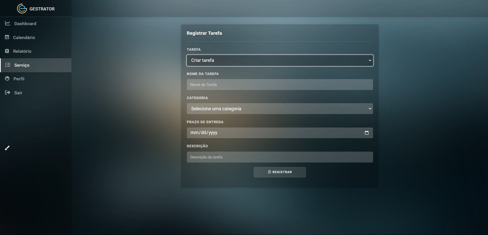
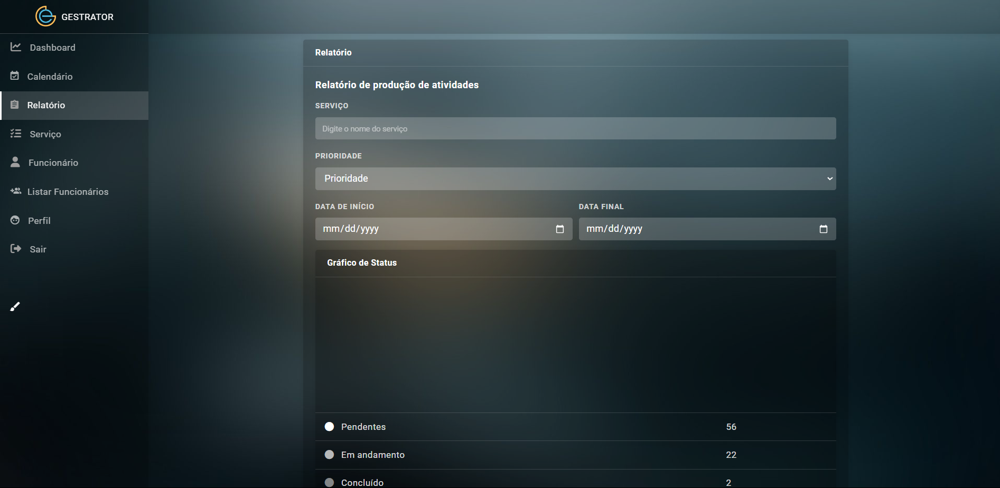

# Gestrator 

Gestrator is a powerfull ERP to help companies manage all your suplies, like time, people and task and even there is chat you can tell to your team . It is a straightforward way to help your team and staffs.

With our system you'll uproot the seeds that you had planted by now choosing this system whose made with a great care. With more time to do task that care you can slow down and take your stress out in a at ease way.

---

# How it works

Basically there are three sections: 1- Management 2- HR 3- For all employees. Each of the three has different permitions at whole system and you going to know right now.

## Management

The special permitions, he has the control to tell to employers the service them must to do and sending tasking to them

## HR

With the special permitions HR you can: register a employee in system; search for a employee; to tell to employers the service them must to do and create a report.

## Employee

The employees only use system to see the task they must to do.

---

# Meet our team 😎

**Your team is composed by:** 

**Alvaro Barcelos** - (ownership of that repository)

[Alvaro Lomeu](https://github.com/Alvaro-Lomeu)

**Geovani Tales**

[Henrique Reis](https://github.com/RickAllstar)

[Ismael Henrique](https://github.com/mael-10)

[Rafael do Carmo](https://github.com/RafaeldoCarmoP)

[Renzo Lutkenhaus](https://github.com/11082005)
